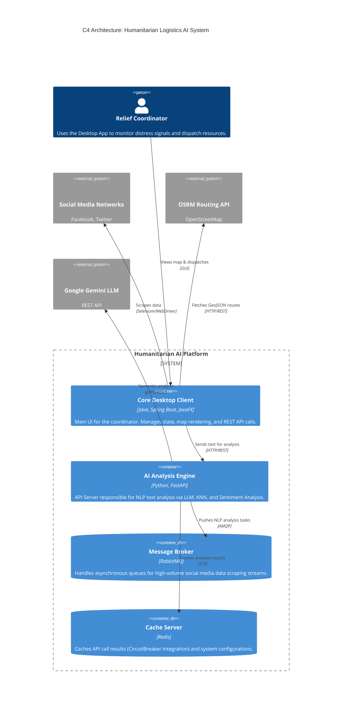

# Humanitarian Logistics AI System 🌍🚁

[](https://github.com/wiz/Humanitarian-Logistics-AI-System/actions/workflows/main.yml)
[](https://spring.io/projects/spring-boot)
[](https://fastapi.tiangolo.com/)

> **Origin & Development Note (v2.0)** 🚀
> 
> This project originally started as an academic coursework assignment in collaboration with the initial group of authors. You can find the original source code here: [Tom984-vn/KeyEmotion_through_SocialMedia](https://github.com/Tom984-vn/KeyEmotion_through_SocialMedia).
> 
> In this current version (v2.0), the project has been independently developed and heavily refactored into a full-fledged Client-Server architecture. Key enhancements include a modern GUI (JavaFX), integration of advanced AI NLP & KNN models, and a real-time Logistics Routing system.

---

## 🎯 Our Goal
In today's age, social media has become one of the most important ways people express their feelings, opinions, and interests. Driven by this motive, we built an AI system for fast and accurate crowd emotion detection through posts, reactions, and comments on social networks like Facebook and Twitter.

Our goal is to leverage emotion detection on specific disaster-related keywords to improve the efficiency of Humanitarian Logistics. For example: *"Village XYZ is being badly damaged by the Yagi storm and the residents desperately need food and water right away."* Based on these signals, our system can immediately coordinate and dispatch trucks loaded with food, water, and medical supplies directly to Village XYZ.

---

## 🏗 System Architecture (C4 Model)

The system utilizes a hybrid Microservices & Modular Monolith architecture.



---

## 🚀 Technical Highlights

### 1. Spring Boot & JavaFX Integration
An Event-Driven architecture combines the power of Spring Boot's Dependency Injection (IoC) with the JavaFX Desktop platform. The UI remains fully non-blocking by offloading all HTTP/REST logic to background threads and updating the interface via `Platform.runLater()`.

### 2. OSRM / A* Routing (Logistics Algorithm)
Integrates the **OSRM** open-source map API (based on OpenStreetMap data) to calculate real-world routes instead of straight-line (Haversine) distances. The `RouteFinder` module is designed using the Strategy/Service pattern, making it highly extensible to other map providers like OpenRouteService (which supports `avoid_polygons` for storm avoidance).

### 3. Resilience4j Circuit Breaker
HTTP connections from the Java Client to the Python FastAPI are protected by a **Circuit Breaker**.
If the AI Server crashes or experiences high load (Error rate > 50%), the system automatically opens the circuit (OPEN state) and returns default *Fallback* results (e.g., Urgency = LOW). This guarantees that the coordinator's GUI never crashes.

### 4. Multithreading & Data Scraping (Selenium)
Utilizes Selenium WebDriverManager with Headless Browsers to continuously listen for and scrape disaster relief posts via keywords on social media in the background.

---

## 📂 Project Structure

```text
Humanitarian-Logistics-AI-System/
├── java_core/                      # Java Client (Spring Boot + JavaFX)
│   ├── src/main/java/.../gui       # UI (Controllers, FXML, CSS)
│   ├── src/main/java/.../ai_client # Resilience4j REST Client connecting to FastAPI
│   ├── src/main/java/.../logistics # OSRM Routing and Resource Allocation Logic
│   └── src/test/java/...           # JUnit 5 & Mockito Unit Tests
├── python_ai_engine/               # AI Backend (FastAPI + LLM)
│   ├── api/                        # REST Controllers
│   ├── models/                     # KNN & Sentiment Logic
│   └── data_collector_and_analyzer.py 
├── docker-compose.yml              # Infrastructure setup (Redis, RabbitMQ)
└── README.md                       
```

---

## 🛠 Installation & Setup Guide

### 1. Initialize Infrastructure
The project requires **RabbitMQ** and **Redis**. Run the following command in the root directory:
```bash
docker-compose up -d
```

### 2. Run the Python AI Engine
Setup the virtual environment and start the FastAPI Server:
```bash
cd python_ai_engine
pip install -r requirements.txt
uvicorn main:app --reload --port 8000
```

### 3. Run the Java Client (UI)
Use Maven to build and run the Spring Boot + JavaFX application:
```bash
cd java_core
mvn clean install
mvn spring-boot:run
```

---

## 🧪 Unit Testing & CI/CD
The project includes a GitHub Actions configuration (`.github/workflows/main.yml`) to automatically run Unit Tests on every `push` or `pull_request`.
- **Java Tests:** Executed using `JUnit 5` and `Mockito`.
- **Local Test Command:** `cd java_core && mvn test`

> **Note**: The Mockito tests simulating the Circuit Breaker short-circuiting (`FastApiRestClientTest.java`) serve as a strong proof of the software architecture's stability and resilience.
